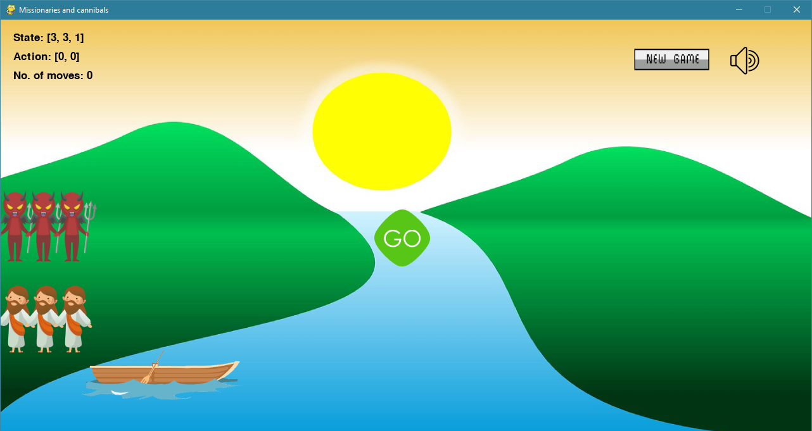
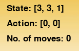
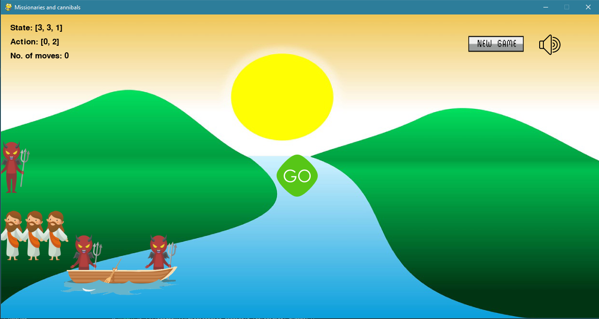
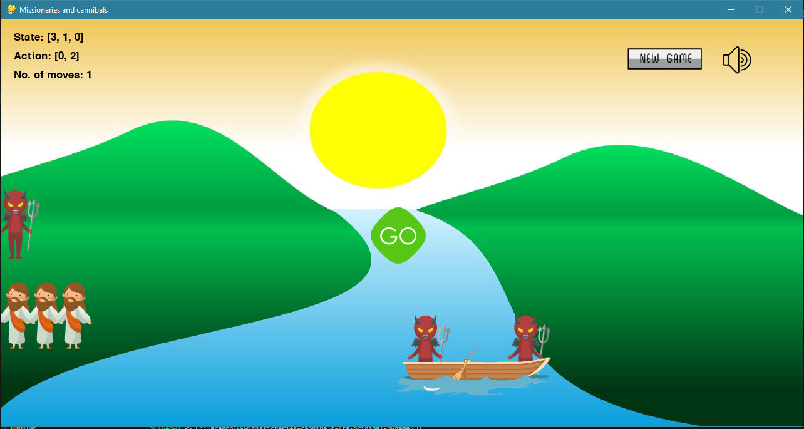
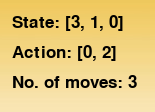
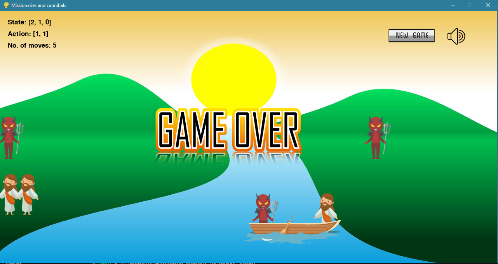
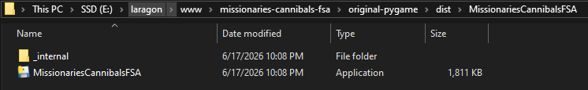
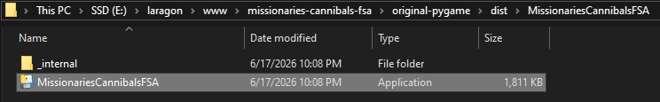
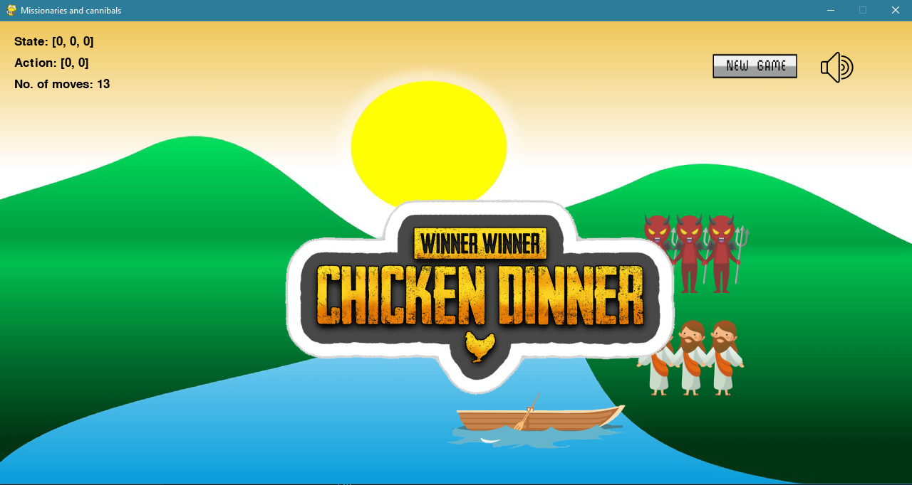

# FSA-Based Missionaries and Cannibals Puzzle Game

Interactive **Python/Pygame desktop puzzle game** based on the classic Missionaries and Cannibals problem. This project demonstrates **Finite State Automata (FSA)** concepts through explicit state representation, state transitions, action validation, and rule-based game-over / win detection.

The main focus of this repository is the **original runnable Pygame application** and the **Windows executable release**. A web-demo folder may exist for reference, but this project is presented primarily as a desktop game and portfolio-ready Python application.

---

## Overview

The Missionaries and Cannibals puzzle starts with three missionaries and three cannibals on one side of a river. The player must move all characters to the opposite side using a boat with limited capacity.

The challenge is that missionaries must never be outnumbered by cannibals on either river bank when missionaries are present. This creates a state-space problem that can be represented using finite states, valid actions, and transitions.

This project turns that logic into an interactive Pygame application where the player can select characters, load the boat, move across the river, observe state changes, and reach either a valid goal state or an invalid game-over state.

---

## Project Highlights

- Original desktop application built with **Python and Pygame**.
- Uses explicit state representation inspired by **Finite State Automata**.
- Displays current state, selected action, and move count in the game window.
- Validates puzzle rules during gameplay.
- Includes animated boat movement and mouse-based interaction.
- Packaged as a Windows executable using **PyInstaller**.
- Prepared with screenshots, demo assets, portfolio documentation, and GitHub-ready README.

---

## Demo Video

Demo video file:

```text
demo-assets/video/missionaries-cannibals-fsa-demo.mp4
```

Recommended public demo options:

- Upload the video to YouTube, Google Drive, or GitHub Releases.
- Add the final video URL here after upload.

Demo video link:

```text
https://missionaries-cannibals-fsa.frengkipurba.com/video/missionaries-cannibals-fsa-demo.mp4
```

Portfolio page:

```text
https://frengkipurba.com/projects/missionaries-cannibals-fsa
```

---

## Download Windows App

Recommended release file:

```text
https://missionaries-cannibals-fsa.frengkipurba.com/downloads/MissionariesCannibalsFSA-Windows.zip
```

Recommended distribution method:

```text
GitHub Releases
```

GitHub Releases link:

```text
https://github.com/frnqpur/missionaries-cannibals-fsa/releases
```

> Note: Windows may show a SmartScreen warning because this is an unsigned portfolio executable. Download only from the official GitHub Release or portfolio link.

---

### 1. Start Screen

Shows the original Pygame desktop application running, including the background, characters, boat, new game button, and sound control.



---

### 2. Initial State

Shows the initial FSA-style state representation in the game UI. The starting state is expected to be `[3, 3, 1]`, meaning three missionaries, three cannibals, and the boat on the left bank.



---

### 3. Character Selection

Shows mouse-based interaction where the player selects a missionary or cannibal before loading passengers onto the boat.


---

### 4. Boat Loading

Shows one or two selected passengers placed on the boat before a crossing. This represents the selected action before a state transition occurs.



---

### 5. Boat Moving

Shows the boat moving between river banks. This visualizes a transition from one game state to another.



---

### 6. State and Action Display

Shows the updated `State`, `Action`, and move count after a crossing. This is the key visual connection between the Pygame UI and the FSA/state-transition concept.



---

### 7. Game-Over State

Shows the game-over screen after the player reaches an invalid state where missionaries are outnumbered by cannibals.



---

### 8. Winner State

Shows the goal state after all missionaries and cannibals are successfully moved to the opposite river bank.


---

### 9. Sound Toggle

Shows the sound on/off control. This demonstrates additional UI handling beyond the core puzzle logic.


---

### 10. Reset / New Game

Shows the reset or new game functionality, allowing the player to restart the puzzle after a win, loss, or unfinished attempt.


---

## Windows Executable Screenshots

### Executable Folder

Shows the PyInstaller output folder containing the packaged Windows application.



---

### Executable Launch

Shows the application launched from the `.exe`, proving that users can run it without executing `python main.py` manually.



---

### Executable Gameplay

Shows the packaged Windows executable during gameplay with state/action text visible.


---

### Executable Winner State

Shows the winning screen in the packaged executable version.



---

## Features

- Interactive Missionaries and Cannibals gameplay.
- Original Pygame desktop implementation.
- Finite State Automata-inspired state representation.
- State and action display in the game window.
- Mouse-based passenger selection.
- Boat loading and crossing animation.
- Rule validation for invalid states.
- Game-over detection.
- Winner detection.
- Move counter.
- New game / reset button.
- Sound toggle.
- Local development setup.
- Windows executable packaging with PyInstaller.
- Portfolio-ready documentation and demo assets.

---

## Tech Stack

- **Python**
- **Pygame**
- **Finite State Automata concept**
- **State transition logic**
- **Rule-based validation**
- **PyInstaller**
- **Markdown documentation**

---

## Repository Structure

```text
missionaries-cannibals-fsa/
├── original-pygame/
│   ├── main.py
│   ├── Person.py
│   ├── Boat.py
│   ├── isi game.ipynb
│   ├── images/
│   ├── music/
│   ├── screenshots/
│   └── requirements.txt
├── demo-assets/
│   ├── screenshots/
│   └── video/
├── release/
├── README.md
├── .gitignore
└── LICENSE
```

## Local Setup

Open PowerShell on Windows:

```powershell
cd "YOUR DIRECTORY"
python -m venv venv
.\venv\Scripts\Activate.ps1
python -m pip install --upgrade pip
pip install -r requirements.txt
python main.py
```

Recommended Python version:

```text
Python 3.11 or Python 3.12
```

Python 3.13 may require troubleshooting depending on Pygame and PyInstaller compatibility.

---

## Original Pygame App

The original application is located in:

```text
original-pygame/
```

Main entry point:

```text
original-pygame/main.py
```

Run the app:

```powershell
cd "YOUR DIRECTORY"
python main.py
```

The game uses Pygame to render the background, missionaries, cannibals, boat, state text, action text, move counter, game-over screen, winner screen, new game button, and sound toggle.

---

## Build Windows Executable

Use the included PowerShell script:

```powershell
cd "YOUR DIRECTORY"
.\build_exe.ps1
```

If PowerShell blocks script execution:

```powershell
Set-ExecutionPolicy -Scope Process -ExecutionPolicy Bypass
.\build_exe.ps1
```

Manual PyInstaller command:

```powershell
pyinstaller --noconfirm --windowed --name MissionariesCannibalsFSA --add-data "images;images" --add-data "music;music" main.py
```

Expected output:

```text
original-pygame/dist/MissionariesCannibalsFSA/MissionariesCannibalsFSA.exe
```

Create release ZIP:

```powershell
Compress-Archive -Path "YOUR DIRECTORY" -DestinationPath "YOUR DIRECTORY" -Force
```

---

## State Representation

The game state is represented as:

```text
state = [M_left, C_left, Boat]
```

Where:

- `M_left` = number of missionaries on the left bank.
- `C_left` = number of cannibals on the left bank.
- `Boat = 1` = boat is on the left bank.
- `Boat = 0` = boat is on the right bank.

The selected action is represented as:

```text
action = [missionaries_on_boat, cannibals_on_boat]
```

A boat crossing updates the state based on the selected action and the boat direction.

---

## Legal Actions

The boat can carry one or two passengers. Common legal action patterns include:

```text
[1, 0]  # one missionary
[0, 1]  # one cannibal
[1, 1]  # one missionary and one cannibal
[2, 0]  # two missionaries
[0, 2]  # two cannibals
```

The game prevents loading more than two passengers onto the boat.

---

## Game Rules

Main safety rule:

```text
Missionaries cannot be outnumbered by cannibals on either bank when missionaries are present.
```

Game-over condition:

```text
(state[0] < state[1] and state[0] > 0) or (state[0] > state[1] and state[0] < 3)
```

Goal state:

```text
state == [0, 0, 0]
```

The player wins when all missionaries and cannibals reach the right bank safely and the boat has no selected passengers.

---

## Portfolio Links

- GitHub: https://github.com/frnqpur/missionaries-cannibals-fsa
- Portfolio page: https://frengkipurba.com/projects/missionaries-cannibals-fsa
- Landing page: https://missionaries-cannibals-fsa.frengkipurba.com

---

## Future Improvements

- Add BFS/DFS automatic solver visualization.
- Show legal next moves dynamically.
- Add a state graph or transition table.
- Add unit tests for state transition logic.
- Improve UI scaling for different screen sizes.
- Add signed Windows releases.
- Automate executable packaging with CI/CD.
- Add a more detailed algorithm explanation page.

---

## Author

**Frengki Josua Purba**

- GitHub: https://github.com/frnqpur
- Portfolio: https://frengkipurba.com
